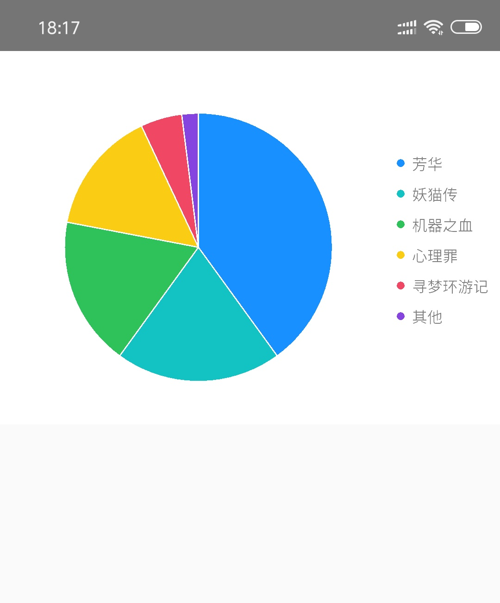

# react-native-f2
antv-f2的react-native实现

**使用此插件，请先安装[GCanvas](https://alibaba.github.io/GCanvas)** *该插件的Android版有很多坑，可以看下示例*

[Demo](https://gitee.com/365t/react-native-f2demo)


## 文档：
文档请看官方的[docs](https://antv.alipay.com/zh-cn/f2/3.x/index.html)

## 使用示例：
### 安装：
一、
```
yarn add react-native-f2
yarn add -D babel-preset-env babel-plugin-transform-remove-strict-mode
或
npm i -S react-native-f2
npm i -D babel-preset-env babel-plugin-transform-remove-strict-mode
```

二、添加如下代码到.babelrc
```
{
  ...
  "plugins": [
    "transform-remove-strict-mode",
    ...
  ]
}
```

### 实例：
```js
import React, { Component } from 'react';
import { Dimensions } from 'react-native';
import F2Canvas from 'react-native-f2';
import F2 from '@antv/f2';

const width = Dimensions.get("window").width;
const height = width - 100;

class Demo extends Component {
  componentDidMount() {
    // 延迟渲染（这里是由于GCanvas加载有延迟导致，如果不是界面渲染完立即加载，可不用延迟）
    setTimeout(() => {
        this.draw();
    }, 20);
  }

  draw = () => {
    const data = [
      { year: '1951', sales: 38 },
      { year: '1952', sales: 52 },
      { year: '1956', sales: 61 },
      { year: '1957', sales: 145 },
      { year: '1958', sales: 48 },
      { year: '1959', sales: 38 },
      { year: '1960', sales: 38 },
      { year: '1962', sales: 38 },
    ];
    // 宽高必须指定（这里是指定F2的）
    const chart = new F2.Chart({
      el: this.$canvas.canvas,
      width,
      height,
    });
    chart.source(data);
    chart.interval().position('year*sales');
    chart.render();
  }

  render() {
    // 这里宽高同上，必须指定且值必须相同（这里指定GCanvas的）
    <F2Canvas ref={e => this.$canvas = e} style={{ width, height }} />
  }
}
```
